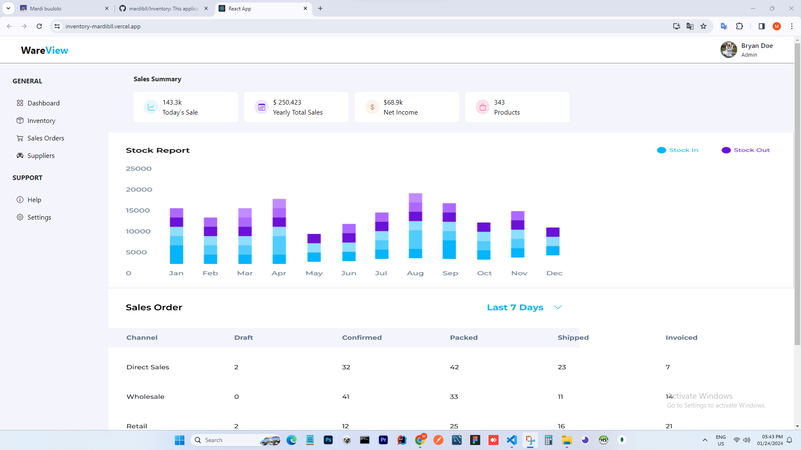

## [Inventory](https://inventory-mardibll.vercel.app/)

This application is a web application that aims to manage the sale of goods, so that it can make it easier to obtain information such as; stock of goods, income, goods data, supplier data, and records of an item. This is very important to do because it can help minimize errors in inventory management and increase efficiency and effectiveness in bus.

### Features

```sh
- List
- Add
- Update
- Delete
- Search
```

### Skills Used

```sh
- React-Js
- Bootstrap
```

<p align="center">
     
     
</p>
